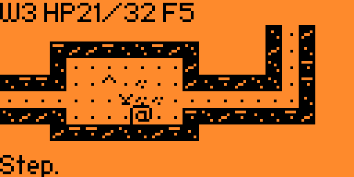
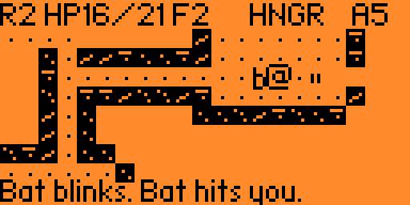
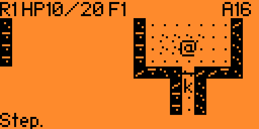
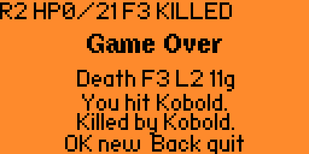
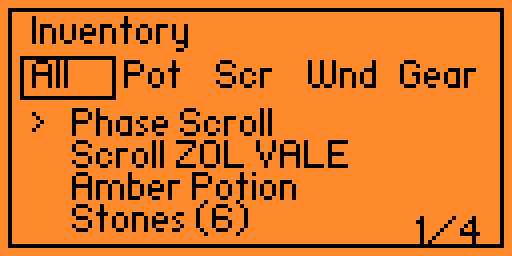
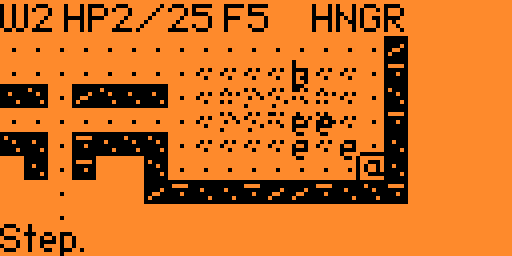

# FlipRogue

FlipRogue is a tiny roguelike dungeon run for Flipper Zero.

It is inspired by Brogue, NetHack, Pathos, and DCSS (Dungeon Crawl Stone Soup),
then folded into a pocket-sized Flipper adventure. Felicia Mirabel's
[Flipperhack](https://github.com/LordKaT/flipperhack) was an early reference for
Flipper app structure and Canvas/Input work, but FlipRogue now has its own game
rules, generation, UI flow, tests, and release tooling.

New to the Dungeons of Yonder? Start with [`docs/HOW_TO_PLAY.md`](docs/HOW_TO_PLAY.md).
For spoilers, numbers, class perks, monsters, and magic tables, see
[`docs/MAGIC_TABLES.md`](docs/MAGIC_TABLES.md).

## Concept

FlipRogue is not a port. It is a short pocket dungeon:

- 18 floors, 64x32 maps, 4-directional movement;
- three classes: Warrior, Ranger, Mage;
- bump combat, straight-line ranged attacks for Ranger/Mage;
- doors, grass, water, sand, ice, fire, traps, grates, chests, shrines, secrets;
- unknown potions, scrolls, wands, Charms, small gear upgrades, food, gold;
- the Orb of Yonder at the bottom, and the Warden after you take it.

The intended feel is readable and slightly mean: small choices, short logs,
quick deaths, and just enough dungeon texture to make the tiny screen feel old.

## Screenshots

| Dungeon map | A rude little fight |
|---|---|
|  |  |

| Early floor | Game over |
|---|---|
|  |  |

| Inventory tabs | Flooded room |
|---|---|
|  |  |

**Flipper memory note:** FlipRogue is near the practical memory edge for a tiny
external app. It may still occasionally quit with an out-of-memory error on
device. Sorry about that; if it happens, restart the app right away and try
another run.

## v1.1 Scope

The current release is the first public-ready build. Highlights:

- seeded procedural floors with room templates, corridors, doors, terrain
  decorators, special-floor biases, and compact floor persistence;
- Warrior/Ranger/Mage starts, automatic level bonuses, and class perk choices at levels
  3 and 6;
- persistent High Scores on SD, sorted by gold with Orb runs promoted;
- `Sound: On/Off` saved to SD as a simple setting;
- finite fire fields, Frost-made ice, flooded rooms, eel packs, sand patches,
  arrow/fire/snare/poison traps, grates with keys/buttons, chests, mimics,
  lurkers, and old god statues;
- the Orb of Yonder and a 199 HP Yonder Warden that follows through saved floors;
- monster behavior for packs, sleep/wander/chase, fleeing, bat blink-strikes,
  archers, slimes, cubes, eels, dragonlings, and other small pests;
- compact Canvas UI: title, class select, map/HUD/log, inventory, item actions,
  chest choice, look/target modes, help, scores, game over, and victory;
- host-side C regression tests for core gameplay rules.

Deferred on purpose:

- save/resume;
- merchants and richer economy;
- heavier AI and larger hazard simulations;
- custom font work beyond the current small tile sprites.

## Controls

Main play:

| Input | Action |
|---|---|
| D-pad | Move, bump-attack, or ranged line-shot for Ranger/Mage |
| Hold D-pad | Repeat movement; repeated held attacks wait for release |
| OK short | Rest, use stairs/buttons, or interact with nearby objects such as chests |
| OK long | Look mode |
| Back short | Game menu |
| Back long | Return to title |

Inventory:

| Item | OK behavior |
|---|---|
| Potion | Choose Quaff, Throw, or Drop |
| Scroll | Choose Read or Drop |
| Wand | Choose Zap or Drop |
| Stones/Darts | Choose Throw or Drop |
| Charm | Choose Wear/Take off or Drop |
| Food | Eat from the menu |

Look and target modes use the D-pad to move the cursor, OK to inspect/apply,
and Back to cancel.

## World Rules

- Walls and closed doors block sight. Closed doors open when stepped through and
  close later when nobody is nearby.
- Tall grass blocks sight, can hide lurkers, and becomes trampled underfoot.
- Puddles and water extinguish burning. Deep water costs two world turns to
  cross, blocks land monsters, and can hold eel packs.
- Frost can freeze connected water into slippery ice; ice can slide actors along
  their movement direction.
- Fire deals 1-3 damage, can ignite actors, refresh finite fire fields, and is
  blocked or doused by water, ice, sand, grates/chests where appropriate.
- Sand blocks fire spread but does not douse a burning actor.
- Ranger sees traps early. Other classes must search, reveal, or step badly.
- Grates are visible locked barriers; a same-floor key or button opens them.
- Chests block movement. A real chest offers one item; a mimic bites first.
- Old god statues are solid. Bump one to hear the dungeon mutter.
- Monsters act after real player turns. Alert monsters remember you, packs wake
  together, and the Warden keeps hunting after the Orb.
- HP 0 ends the run. Victory is taking the Orb back to the surface stairs.

There is no gas, chasm, floating-item water physics, or merchant economy in
v1.1.

## Build

FlipRogue builds as an external Flipper app (`.fap`) with
[UFBT / micro Flipper Build Tool](https://github.com/flipperdevices/flipperzero-ufbt).
UFBT is the lightweight Flipper toolchain path for standalone apps; the official
downloads page also links to its documentation:
[flipper.net/pages/downloads](https://flipper.net/pages/downloads).

Requirements:

- Python 3;
- a host C compiler such as `cc` or `clang` for tests;
- UFBT installed for the same Python used by the build command.

Run host tests:

```bash
python3 build.py test
```

or:

```bash
make tests
```

Build with UFBT directly:

```bash
python3 build.py build
```

or:

```bash
make build
```

Build, test, and copy the `.fap` into `dist/`:

```bash
python3 build.py package
```

or:

```bash
make package
```

Clean generated files:

```bash
python3 build.py clean
```

or:

```bash
make clean
```

If `python -m ufbt` fails, install/update UFBT in that exact Python environment,
for example `python3 -m pip install -U ufbt`, then run the command again from the
folder containing `application.fam`. On first use, UFBT may download SDK/toolchain
files; let it finish. For SDK channel, firmware mismatch, or USB launch issues,
follow the official UFBT docs rather than this README.

## Manual Install

After packaging, copy:

```text
dist/fliprogue.fap
```

to:

```text
/ext/apps/Games/fliprogue.fap
```

The app stores small runtime data on SD:

```text
/ext/apps_data/fliprogue/hiscores.txt
/ext/apps_data/fliprogue/settings.txt
```

`settings.txt` currently contains `sound=1` or `sound=0`.

## Developer Notes

Core rules are split by gameplay layer:

```text
src/game_logic.h
src/*actions.c
src/*state.c
src/monster_*.c
src/room_*.c
src/terrain_effects.c
```

The Flipper wrapper is intentionally thin:

```text
src/fliprogue_app.c
src/ui_*.c
src/score_store.c
```

Before adding more content, keep the host tests green:

```bash
python3 build.py test
make tests
```

`build.py` discovers `src/*.c` for host tests and UFBT uses `sources=["src/*.c"]`
from `application.fam`, so new C modules should be picked up without hand-editing
source lists. The generated release artifact is `dist/fliprogue.fap`.

## Repository Notes

- License: GPL-3.0.
- Generated artifacts live under `dist/` and `.host_build/`.
- Design notes live in [`docs/PROJECT_NOTES.md`](docs/PROJECT_NOTES.md).
